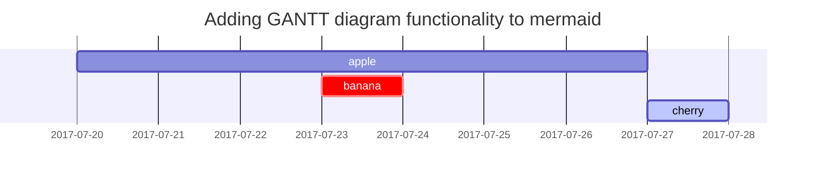

## Headings

<!-- markdownlint-capture -->
<!-- markdownlint-disable -->
# H1 — 一级标题
{: .mt-4 .mb-0 }

## H2 — 二级标题
{: data-toc-skip='' .mt-4 .mb-0 }

### H3 — 三级标题
{: data-toc-skip='' .mt-4 .mb-0 }

#### H4 — 四级标题
{: data-toc-skip='' .mt-4 }
<!-- markdownlint-restore -->

## Paragraph （二级标题）

这是正文内容。

## 列表

### 有序列表

1. Firstly
2. Secondly
3. Thirdly

### 无序列表

- Chapter		#黑点
  - Section	#白点
    - Paragraph	#黑矩

### 代办清单

- [ ] Job
  - [x] Step 1	#已办
  - [x] Step 2	#已办
  - [ ] Step 3	#未办

Sun
: the star around which the earth orbits	#首行缩进

## Block Quote	#引用

> This line shows the _block quote_.	

## Prompts	#提示

<!-- markdownlint-capture -->
<!-- markdownlint-disable -->
> An example showing the `tip` type prompt.
{: .prompt-tip }	#小贴士

> An example showing the `info` type prompt.
{: .prompt-info }	#信息

> An example showing the `warning` type prompt.
{: .prompt-warning }	#警告

> An example showing the `danger` type prompt.
{: .prompt-danger }		#危险
<!-- markdownlint-restore -->	

## Tables		#表格

| Company                      | Contact          | Country |
| :--------------------------- | :--------------- | ------: |
| Alfreds Futterkiste          | Maria Anders     | Germany |
| Island Trading               | Helen Bennett    |      UK |
| Magazzini Alimentari Riuniti | Giovanni Rovelli |   Italy |

## Links		#超链接

<http://127.0.0.1:4000>

[Fork the theme repository](https://github.com/tmxhub).

Visit [**tmxhub**][tmxhub].

## Footnote	#脚注

Click the hook will locate the footnote[^footnote], and here is another footnote[^fn-nth-2].

## Inline code	#行内代码

This is an example of `Inline Code`.

## keyboard input	#键盘输入元素
The <kbd> tag is used to define <kbd>keyboard input</kbd>. The content inside is displayed in the browser's default monospace font.

## Filepath	#文件路径

Here is the `/path/to/the/file.extend`{: .filepath}.

## Code blocks	#代码块

### Common

```text	#纯文本代码块
This is a common code snippet, without syntax highlight and line number.
```

### Specific Language	#特殊语言代码块

```bash	#Shell
if [ $? -ne 0 ]; then
  echo "The command was not successful.";
  #do the needful / exit
fi;
```

### Specific filename	#特殊文件名

```sass
@import
  "colors/light-typography",
  "colors/dark-typography";
```
{: file='_sass/jekyll-theme-chirpy.scss'}

## Mathematics	#公式

The mathematics powered by [**MathJax**](https://www.mathjax.org/):

$$
\begin{equation}
  \sum_{n=1}^\infty 1/n^2 = \frac{\pi^2}{6}
  \label{eq:series}
\end{equation}
$$

We can reference the equation as \eqref{eq:series}.

When $a \ne 0$, there are two solutions to $ax^2 + bx + c = 0$ and they are

$$ x = {-b \pm \sqrt{b^2-4ac} \over 2a} $$

## Mermaid SVG	#图表



## Images	#插入图片

### Default (with caption)

{: width="972" height="589" }	#配图路径
_Full screen width and center alignment_	#配图标题

### Left aligned	#左对齐

{: width="972" height="589" .w-75 .normal}

### Float to left	#图片浮于文字左侧

{: width="972" height="589" .w-50 .left}
Praesent maximus aliquam sapien. Sed vel neque in dolor pulvinar auctor. Maecenas pharetra, sem sit amet interdum posuere, tellus lacus eleifend magna, ac lobortis felis ipsum id sapien. Proin ornare rutrum metus, ac convallis diam volutpat sit amet. Phasellus volutpat, elit sit amet tincidunt mollis, felis mi scelerisque mauris, ut facilisis leo magna accumsan sapien. In rutrum vehicula nisl eget tempor. Nullam maximus ullamcorper libero non maximus. Integer ultricies velit id convallis varius. Praesent eu nisl eu urna finibus ultrices id nec ex. Mauris ac mattis quam. Fusce aliquam est nec sapien bibendum, vitae malesuada ligula condimentum.

### Float to right	#图片浮于文字右侧

{: width="972" height="589" .w-50 .right}
Praesent maximus aliquam sapien. Sed vel neque in dolor pulvinar auctor. Maecenas pharetra, sem sit amet interdum posuere, tellus lacus eleifend magna, ac lobortis felis ipsum id sapien. Proin ornare rutrum metus, ac convallis diam volutpat sit amet. Phasellus volutpat, elit sit amet tincidunt mollis, felis mi scelerisque mauris, ut facilisis leo magna accumsan sapien. In rutrum vehicula nisl eget tempor. Nullam maximus ullamcorper libero non maximus. Integer ultricies velit id convallis varius. Praesent eu nisl eu urna finibus ultrices id nec ex. Mauris ac mattis quam. Fusce aliquam est nec sapien bibendum, vitae malesuada ligula condimentum.

### Dark/Light mode & Shadow	#根据主题切换显示

The image below will toggle dark/light mode based on theme preference, notice it has shadows.

{: .light .w-75 .shadow .rounded-10 w='1212' h='668' }
{: .dark .w-75 .shadow .rounded-10 w='1212' h='668' }

## Video		#插入视频




## 脚注

[^footnote]: The footnote source
[^fn-nth-2]: The 2nd footnote source
[tmxhub]: https://github.com/tmxhub
